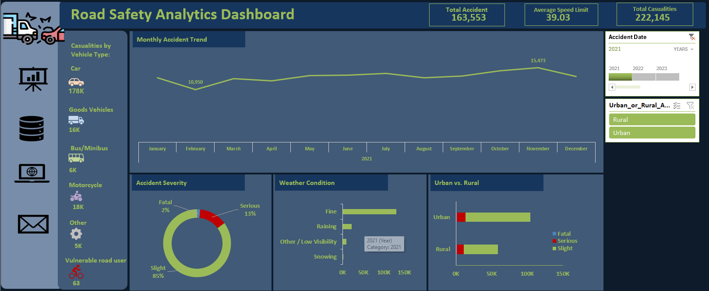

# Road Safety Analytics Dashboard
## CoreTech Labs Capstone Project

## Project Overview
This project focuses on a comprehensive statistical analysis of road traffic accidents. Using a dataset of 307,972 records, I transformed raw, unstructured data into a high-fidelity interactive dashboard. The primary goal is to provide stakeholders with actionable insights to drive data-informed safety policies and resource allocation.

## Dashboard Preview

Figure 1: Final Interactive Road Safety Analytics Dashboard.
## Key Features & Functionality
- Interactive KPI Cards: Real-time tracking of Total Accidents (307,972), Average Speed Limit (38.87 mph), and Total Casualties (417,882).
- Dynamic Filtering: Integrated Slicers for Urban vs. Rural areas and Accident Date (Yearly/Monthly) to allow for deep-dive analysis.
- YoY Trend Analysis: Implemented Year-on-Year (YoY) comparison with dynamic icon sets (Arrows) to signal improvement or decline in safety metrics.
- Vehicle & Environmental Breakdown: Visual distribution of casualties by vehicle type (Cars, Motorcycles, etc.) and weather conditions.

## Technical Skills Demonstrated

1. Data Cleaning & Standardisation
- Handled missing and inconsistent values using advanced Excel formulas.
- Standardised categorical data for vehicle types and environmental factors.
- Grouped data into "Vulnerable Road User" categories for targeted analysis.

2. Descriptive Statistical Analysis
- Calculated Central Tendencies (Mean, Median, Mode) for casualties and speed limits.
- Analysed Data Distribution (Skewness of 5.68) to identify outliers and variance.

3. Advanced Excel Techniques
- Pivot Tables & Charts: Aggregated over 300k rows of data for dynamic reporting.
- Conditional Formatting: Applied custom logic to Icon Sets for trend indicators.
- Linked Objects: Used Linked Pictures and the Camera Tool to maintain visual consistency in KPI cards.

## Key Insights & Recommendations
- Urban Hotspots: Urban areas account for a significantly higher volume of accidents; infrastructure safety should be prioritised here.
- Car Casualties: With 333,000 casualties attributed to cars, driver awareness campaigns are essential.
- Seasonal Peaks: November consistently shows a spike in accidents, correlating with raining and low-visibility weather conditions.

## Repository Structure
```text
├── Data/               # Raw and Cleaned Datasets (Sample)
├── Dashboard/          # Final Excel (.xlsx) Dashboard File
├── Reports/            # Final Word Report (PDF) and Presentation
├── Images/             # Screenshots of Dashboard and Charts
└── README.md           # Project Documentation (This file)
```
## Conclusion
This project demonstrates the power of data storytelling. By bridging the gap between raw numbers and visual analytics, I have developed a tool that empowers CoreTech Labs to make informed decisions to save lives and improve road infrastructure.
